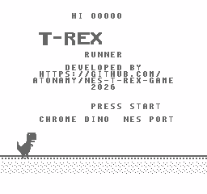
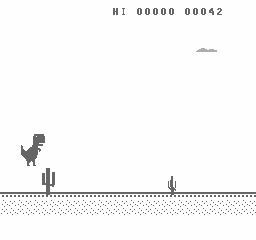
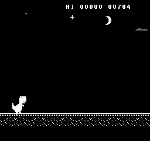
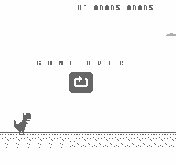
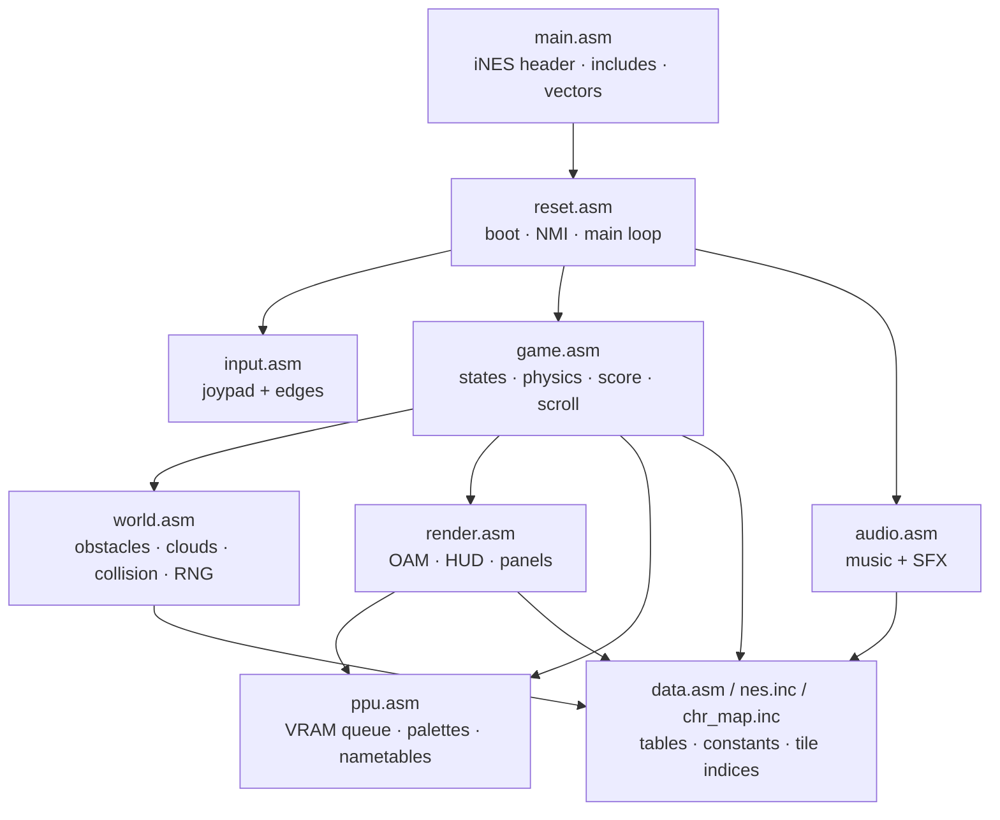
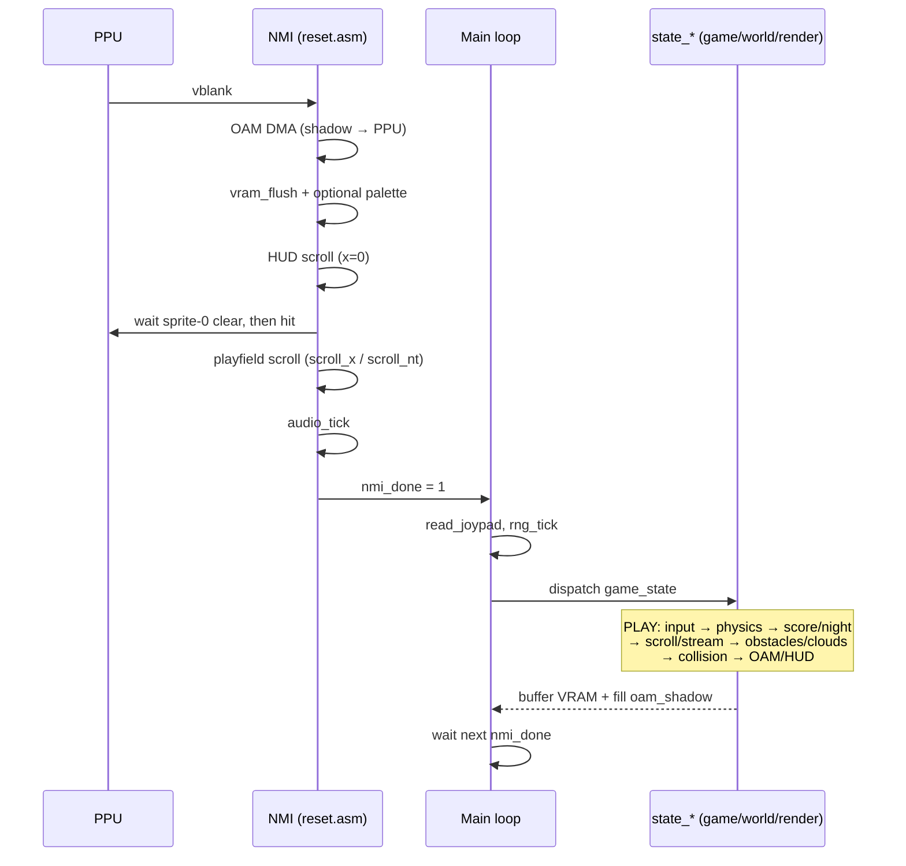
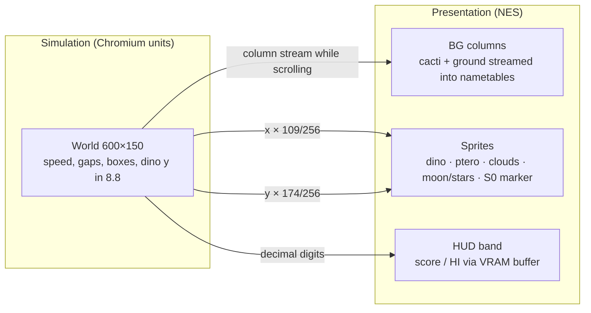
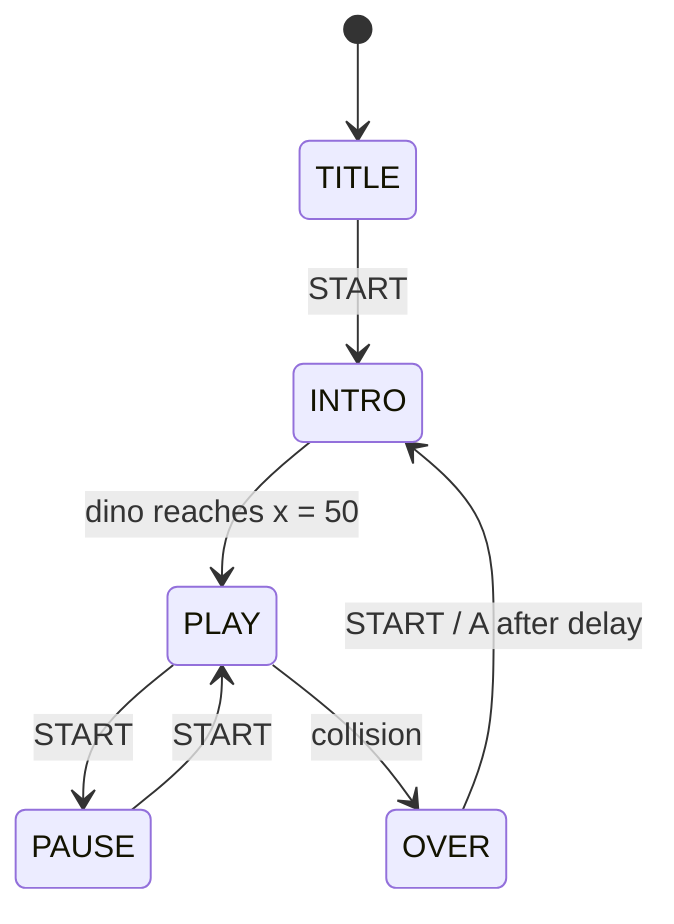

# T-Rex Runner — Chrome Dino, on an actual NES

A from-scratch port of Chrome's offline dinosaur game to the Nintendo
Entertainment System, written in 6502 assembly. Same physics, same obstacle
rules, same scoring — running on 1985 hardware: a 1.79 MHz 6502, 2 KB of RAM,
and a PPU that can't scroll two things at different speeds without a trick.

Ported from the Chromium source:
[`components/neterror/resources/dino_game/`](https://source.chromium.org/chromium/chromium/src/+/main:components/neterror/resources/dino_game/).


## Screenshots

| Title | Gameplay | Night mode | Game over |
|---|---|---|---|
|  |  |  |  |

## Features

- **Physics ported value-for-value from the Chromium source** (see the
  fidelity table below): speed-scaled jump velocity, variable jump height
  (release early / speed-drop with DOWN in mid-air), gravity, ducking, and
  the original collision boxes for the T-Rex, cacti, and pterodactyls.
- **Original obstacle rules**: small/large cacti in groups of 1–3
  (speed-gated), pterodactyls at 3 heights (jump / duck / fly-over) once speed
  passes 8.5, the original gap formula (`width*speed + minGap*0.6 .. *1.5`),
  and the max-2-duplicate-in-a-row rule.
- **Speed ramp** 6 → 13 and **score** at the original rate (1 point per 40
  world px), 5-digit display, persistent HI score, a 100-point ding + flash.
- **Day/night cycle**: palette inversion every 700 points; a stationary
  crescent moon and twinkling stars, with clouds drifting past in front.
- **Title screen, pause/resume, game-over panel** with a restart icon copied
  pixel-for-pixel from Chrome's own sprite sheet.
- **Sound**: jump blip, 100-point ding, crash, plus a 4-channel chiptune
  (pulse lead + harmony, triangle bass, noise drums) for the title, gameplay,
  and game-over themes.

## Fidelity

Every gameplay constant was checked against the Chromium `dino_game` source.
Identical values:

| Parameter | Value (both) | Chromium source |
|---|---|---|
| Jump velocity | −10 − speed/10 | `trex.ts` `startJump` |
| Gravity | 0.6 / frame | `trex.ts` `normalJumpConfig` |
| Min/max jump height | 30 / 30 (end-jump at y<30) | `trex.ts` `normalJumpConfig` |
| Drop velocity (early release) | −5 | `trex.ts` `dropVelocity` |
| Speed-drop coefficient | ×3 fall, vy := 1 | `trex.ts` `setSpeedDrop` |
| T-Rex world x position | 50 | `trex.ts` `startXPos` |
| Collision boxes (all 9 + duck) | identical | `trex.ts`, `offline_sprite_definitions.ts` |
| Cacti | w 17/25, y 105/90, multipleSpeed 4/7, minGap 120, sizes 1–3 uniform | `offline_sprite_definitions.ts`, `obstacle.ts` |
| Pterodactyl | w 46, y {100, 75, 50}, minSpeed 8.5, speed ±0.8, 6 fps flap | `offline_sprite_definitions.ts` |
| Gap formula | `w·speed + minGap·0.6` … ×1.5, random in range | `obstacle.ts` `getGap` |
| Speed range | 6 → 13 | `offline.ts` |
| Obstacle-free grace | 3000 ms (180 frames) | `offline.ts` `clearTime` |
| Score rate | distance × 0.025 | `distance_meter.ts` |
| Night trigger | every 700 points | `offline.ts` `invertDistance` |

Known deviations (all deliberate or inherent to the hardware):

- **World motion is whole-pixel**: obstacles and the ground scroll move
  `floor(speed)` world px per frame — the fractional part of the current
  speed is not accumulated into motion (it *is* used for scoring and gap
  math). At speed 8.9 the world moves 8 px/frame where the original moves
  8.9. Everything on screen stays mutually consistent.
- **Speed ramp**: +1/256 every 4 frames ≈ 0.000977/frame vs the original's
  0.001/frame — about 2% slower to reach max speed.
- **8.8 fixed point**: gravity is stored as 154/256 ≈ 0.6016; the gap
  formula truncates `w·speed` instead of rounding (≤1 px); the original
  rounds the T-Rex's y to whole pixels every frame while the port keeps
  sub-pixel precision — jump arcs can differ by a fraction of a pixel.
- **RNG**: a 16-bit Galois LFSR stands in for `Math.random()`; gap and size
  rolls have negligible modulo bias.
- **Night duration**: 350 points (half the cycle) instead of the original's
  fixed 12 s, so day and night stay evenly split at any speed.
- **Obstacle spawn x**: 640 instead of 600 (the NES streams cacti into the
  scrolling background ahead of the visible edge); the spawn *threshold*
  moved with it, so obstacle spacing — the thing that matters — is identical.
- **Frame-locked timing**: the original scales physics by real elapsed time;
  the NES steps once per video frame (60 fps NTSC — on a PAL console
  everything runs proportionally slower, as was traditional).
- **Sprites are redrawn for the NES**: art is scaled to NES pixels and tile
  grids, so on-screen sizes differ from the original's 44×47 T-Rex — but
  collision runs in original world units with the original boxes.

## Controls

| Button | Action |
|---|---|
| START | start game · pause / resume · restart |
| A or ↑ | jump (hold for a higher jump) |
| ↓ | duck while running · fast-fall in mid-air |

## Build

Requires only [cc65](https://cc65.github.io/) (`ca65` + `ld65`):

```sh
make            # -> build/trex.nes
make run        # open in Mesen (macOS, /Applications/Mesen.app)
```

`build/trex.chr` (the compiled tile/sprite data) ships pre-built, so no other
tooling is needed to go from source to ROM. Load `build/trex.nes` in any NES
emulator, or on real hardware via a flash cart.

## Why an NES port of a web game is harder than it sounds

The original game simulates in a continuous 600×150 coordinate space and
scrolls one uniform background. The NES gives you a 256×240 tile grid, 64
sprites total, no per-pixel background scroll speed control, and a CPU that
has to finish all of that math, collision, and rendering setup in the ~2,270
cycles between one video frame and the next. A few of the tricks this port
leans on:

- **World simulation stays in the original 600×150 units** (8.8 fixed point),
  converted to NES screen space only at render time (`×109/256` horizontal,
  `×174/256` vertical) — so the physics constants are lifted straight from
  Chromium instead of being re-derived and re-tuned.
- **Cacti are background tiles, not sprites.** They're streamed into the
  scrolling nametable one column at a time as the world scrolls, so even a
  wall of three large cacti costs **zero** sprites. Only the T-Rex,
  pterodactyls, clouds, and the night moon/stars use sprites. The game
  enforces the scanline budget structurally — two live pterodactyls are
  never given the same flight height, and clouds are pinned to four
  non-overlapping altitude bands — so the worst possible case is 7 sprites
  on a line (ducking under a low pterodactyl), under the NES's 8-sprite
  limit; measured worst over long automated runs is 6. No flicker.
- **The score line doesn't scroll — the ground does**, on the same
  nametable. That split is done with a sprite-zero-hit trick: an invisible
  marker sprite fires mid-frame, and the NMI handler swaps the PPU's scroll
  register the instant it does, so the HUD band and the playfield can scroll
  at different rates on hardware that only has one scroll register.
- **Decimal score with manual BCD**, 16-bit RNG and gap math, and a
  fixed-point jump arc — all in 6502 assembly with no floating point.

## Architecture

The port is built around one idea: **simulate Chrome's game, render the NES
afterward.** Physics, gaps, scoring, and collision stay in the original
600×150 world with 8.8 fixed-point math. NES pixels, OAM slots, and nametable
columns are derived only at draw / stream time (`×109/256` horizontal,
`×174/256` vertical). That keeps Chromium constants intact instead of retuning
everything for a 256×240 screen.

### Modules



| Layer | Files | Responsibility |
|---|---|---|
| Boot / frame | `reset.asm` | Reset, NMI (PPU + APU), main-loop dispatch |
| Input | `input.asm` | Controller shift register → `joy_cur` / `joy_press` / `joy_release` |
| Game logic | `game.asm` | State machine, jump physics, speed/score/night, world scroll + BG column stream |
| World | `world.asm` | Obstacle spawn/move, clouds, multi-box collision, LFSR RNG, night sky pick |
| Present | `render.asm` | Shadow OAM (dino, pteros, clouds, moon/stars, sprite-0 marker), score tiles, UI |
| PPU I/O | `ppu.asm` | Deferred VRAM buffer, palette load, title/playfield nametable build |
| Audio | `audio.asm` | 4-channel sequencer + one-shot SFX with channel ownership |
| Data | `data.asm`, `nes.inc`, `chr_map.inc` | Collision boxes, palettes, music, hardware map, ZP layout |

### Frame loop

Work is split the usual NES way: **NMI owns the PPU and APU; the main thread
owns simulation.** The main loop sleeps on `nmi_done`, runs one state tick, then
sleeps again — so logic is locked to vblank (60 Hz NTSC).



During `ST_PLAY` the order is fixed so side effects stay predictable:

1. **Input / physics** — jump, duck, speed-drop, 8.8 gravity integration  
2. **Meter** — speed ramp, distance → score, night trigger  
3. **World** — scroll accumulator, BG column stream (ground + cacti), obstacles, clouds  
4. **Collide** — original multi-box AABBs in world units  
5. **Present** — rebuild shadow OAM + queue score digit tiles  

NMI never runs gameplay. It only pushes the previous frame's OAM/VRAM, performs
the sprite-zero scroll split, and ticks audio.

### Coordinate spaces



Cacti never become sprites: as the playfield scrolls, `stream_column` writes the
next vertical tile strip into the nametable ahead of the camera. Pterodactyls,
clouds, and the T-Rex stay in OAM, with flight heights and cloud bands chosen so
a scanline cannot exceed the hardware 8-sprite limit.

### Game states



`INTRO` rebuilds the playfield, resets speed/score/obstacles, and runs the dino
in from the left while the ground already scrolls — then hands off to `PLAY`
with the same systems live.

## Project structure

```
src/            6502 source (ca65 syntax)
  main.asm        iNES header, segment layout, includes
  reset.asm       startup, NMI handler, main loop
  game.asm        state machine, physics, input, scoring
  world.asm       obstacles, clouds, collision, RNG, night sky
  render.asm      sprite/OAM composition, UI panels, HUD
  ppu.asm         VRAM buffer, palettes, nametable setup
  audio.asm       APU driver, music sequencer, sound effects
  input.asm       joypad reading
  data.asm        lookup tables, strings, palettes, collision boxes
  nes.inc         hardware registers, constants, zeropage map
  chr_map.inc     tile index constants (matches build/trex.chr)
build/
  trex.chr        pre-built CHR-ROM (tile + sprite pattern data)
nes.cfg         ld65 linker config (NROM-256, vertical mirroring)
Makefile
```

## License

NES port code and original port assets are **MIT** — see [`LICENSE`](LICENSE).

Derived Chromium dino design, physics constants, obstacle rules, scoring
behavior, and related reference material remain under Chromium's **BSD-style**
terms — see [`NOTICE`](NOTICE).

## Credits

- Original game design, art, and physics: the Chromium project —
  [`components/neterror/resources/dino_game/`](https://source.chromium.org/chromium/chromium/src/+/main:components/neterror/resources/dino_game/)
  (BSD-licensed).
- NES port: [atonamy](https://github.com/atonamy), 2026.
- Engine: Kimi K3.
- Debugging, refinement, and bug fixes: Fable 5.
- Music: GPT-5.6 Sol.
- Development and debugging tool: [atonamy/mesen-agent](https://github.com/atonamy/mesen-agent).
